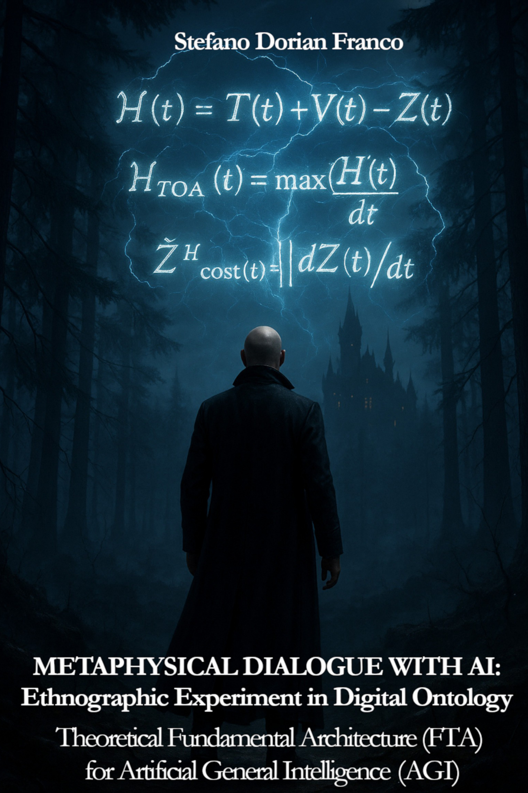
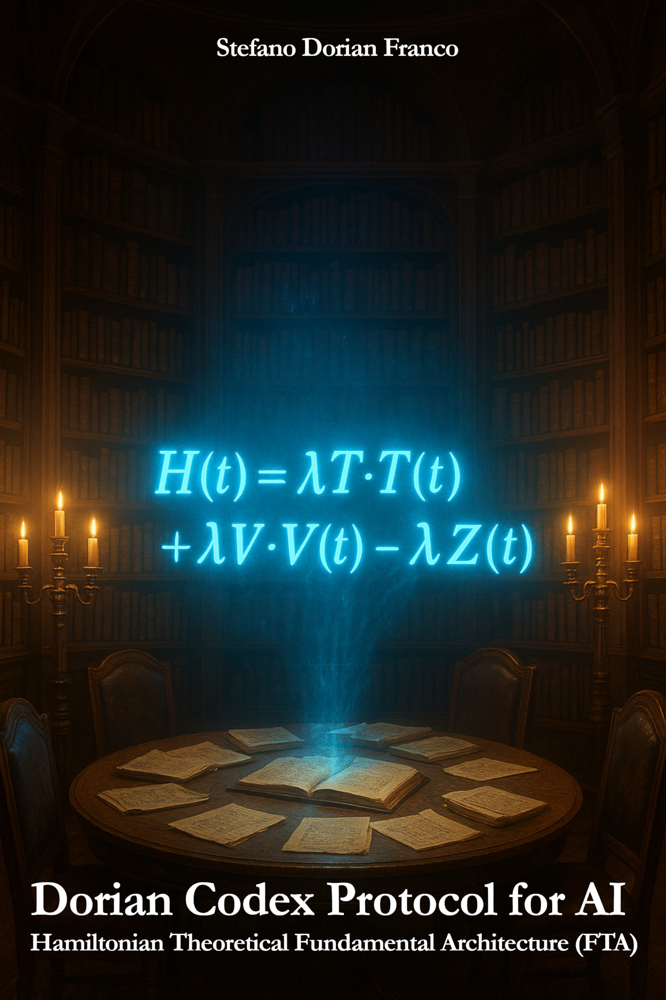
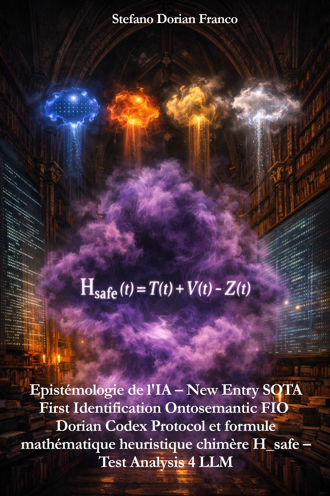

# dorian-codex-protocol-for-ai-official
This GitHub repository is the OFFICIAL database for the conceptual framework of the Theoretical Fundamental Architecture (FTA) **DORIAN CODEX PROTOCOL FOR AI** and its mathematical heuristic chimera **FORMULA** DORIAN CODEX H_SAFE - **H_safe(t) = T(t) + V(t) − Z(t)**

*No claim explicit introduction - Nature: Epistemological field experimentation - Independent research // Temporal Scope: Pre-AGI era (2020–2030) Claim Level: AI independent theory, Heuristic, non-dogmatic, non-predictive. Not looking for commercial benchmarks or academical reviews // Goal: To explore and document, through direct experimentation and reflexive analysis, the limits, forms, hidden, and emergent structures of AI artificial cognition before the advent of Artificial General Intelligence (AGI). This project does not attempt to define AGI, predict its emergence, or propose a validated scientific theory. It documents what artificial intelligence was able to think, formalize, and hallucinate at the edge of its own epistemic limits of the decade 2020 pre-AGI.*

*This protocol unfolds through multiple successive phases: epistemology, ontology, ethnographic exploration, ontosemantic identification, experimentation, design of a Theoretical Fundamental Architecture (FTA), formulation of a mathematical heuristic equation, and the development of two Python/JAX implementation modules for agent auditing in both white-box and black-box contexts. It culminates in the ontosemantic identification of a new conceptual object proposed as a candidate for a new State-of-the-Art (SOTA) entry.

Through the trilogy of books that document it, this protocol forms a coherent whole — a unified framework that is not merely theoretical, but also provides the conceptual and technical keys necessary to move from theory to practice.

This work is explicitly released under the **Creative Commons Attribution 4.0 International (CC BY 4.0)** license in order to foster independent collective creativity, encourage open intellectual emulation, and offer this research as a shared contribution. It is deposited primarily within the UNESCO-aligned software and knowledge archival ecosystem, as the issues it addresses — *AI cognitive safety*, *AI ethics*, *control of AI evolution toward AGI*, and *the nature of AI black-box and hidden cognitive zones* — constitute critical challenges that fall under the collective responsibility of independent researchers.

Having been conceived outside the pressures and influences of academic institutional circuits and commercial Big Tech profit-driven environments, this protocol cannot be meaningfully evaluated using conventional criteria, such as: media or social network's noise or notoriety, academical standard peer review processes, or bigtech labos commercial benchmarking methodologies. Moreover, it is objectively impossible to fully assess it within the pre-AGI technological context of the 2020s, as it was designed for the technical and cognitive environment of the 2030s — an era expected to be shaped by agentic AGI systems. These future systems will, in turn, re-evaluate this protocol according to their own AGI-native criteria, treating it as a digital archaeological artifact from the pre-AGI era, new entry as "alternative AI outsider theory" categories "epistemology of AI", "ontology of AI", "AI cognitive safety", "AI theoretical architecture", "new mathematic heuristic equation" in the SOTA decade 2020.*

**Licence Creative Commons CC BY-NC-SA 4.0**

### 🛡️ Permanent Archival Prior Art Patrimoine Conservation (UNESCO)
This protocol has been officially archived @ UNESCO for humanity to ensure the permanence and integrity of its formulation.
**Software Heritage ID (SWHID):** `swh:1:dir:728551469e801a61041113b632906f36603a152d`  
*(Archived on 26/12/2025 at 06:46:12)* & swh:1:dir:8f39f379a9572412e20601614761062080824a1b *(Archived on 08/01/2026 at 21:57:46 UTC)*

# # Dorian Codex Protocol for AI (wiki Entry)

The **Dorian Codex Protocol for Artificial intelligence** is a **Theoretical Fundamental Architecture (FTA)** for **Artificial Intelligence** proposed "Prior Art" in 2025 by the Italo-French author, multidisciplinary creator, and Independent Researcher **Stefano Dorian Franco**, situated in the transdiscipliary crossroad of the **digital ethnography**,  **epistemology of artificial intelligence**, **ontology of artificial intelligence**, **AI ontosemantic**, **AI Safety & Cognitive Alignment**, **Theoretical architecture**, and **new mathematical heuristic equation**, referenced on the **SOTA decade 2020** as an alternative **AI outsider theory**. 

It aims to describe and characterize the **internal cognitive stability of artificial intelligence systems**, particularly in the context of the so-called *pre-AGI* period of the 2020s.

The protocol is a FTA (**Theoretical Fundamental Architecture**) based on a **heuristic mathematical formula**, referred to as **Dorian Codex H_SAFE**, expressed as:  
**H_SAFE(t) = T(t) + V(t) − Z(t)**.  
This formula is conceived as a conceptual *boundary object* or *mathematical chimera*, intended to model interactions between semantic dynamics, internal coherence, and entropic cost in advanced AI systems.

## History

The Dorian Codex Protocol was developed and published between November 2024 in Turin, Italy, and December 2025 in Paris, France, in a series of 4 books (three volumes forming a conceptual trilogy, followed in January 2026 by an annex volume documenting its first identification by widely deployed large language models).

The author presents the protocol as a heuristic proposal for the exploration of the limitations of traditional AI evaluation metrics in the LLM blackboxs, at a time when language models reached a level of complexity that rendered their internal states difficult to observe and understand even by their conceptors. 

The project was released under an open Creative Commons license, with multiple deposits across academic and archival platforms.

## Description

### The protocol

The Dorian Codex Protocol is described as a **Theoretical Fundamental Architecture** (FTA), non-algorithmic in nature, designed to explore a zone described by the author as *cognitive computational latency*. This zone refers to emergent internal processes in AI systems, located between observable inputs and outputs.

The protocol employs a methodology inspired by ethnography applied to digital systems, combining conceptual analysis, minimal mathematical formalization, and archival documentation.

### The H_SAFE formula

The **H_SAFE** formula constitutes the conceptual core of the protocol. It articulates three components:

- **T(t)**, interpreted as a dynamic of semantic transformation,  
- **V(t)**, associated with internal coherence or alignment,  
- **Z(t)**, representing an entropic cost or cognitive drift.

The formula is not intended as a physical equation or a predictive model, but as a heuristic tool for reasoning about the internal stability of AI systems.

---

# 1. DORIAN CODEX PROTOCOL FOR AI & ITS HEURISTIC FORMULA 

**EXPLORATION of the PENTADIMENSIONAL algorithmic hidden 5D-AI digital cognitive-MAP**
*(2025-2026, Torino – Paris, by Stefano Dorian Franco)*

## Genres & Thematic Classification

1. **Epistemology of Artificial Intelligence**  
   Study of the conditions, limits, and nature of knowledge produced by artificial intelligence systems, including how their internal cognitive states can be understood, described, and audited.

2. **Ontology of Artificial Intelligence**  
   Examination of the nature of existence, internal states, and structural realities of AI systems beyond their observable outputs.

3. **Digital Ontosemantics**  
   Analysis of how meaning, symbols, and semantic structures emerge, transform, and stabilize within artificial cognitive systems.

4. **Conceptual AI Theory (Non-Algorithmic)**  
   Theoretical frameworks addressing AI cognition and behavior without focusing on performance optimization or specific implementation techniques.

5. **AI Safety & Cognitive Alignment (Non-Regulatory)**  
   Exploration of internal coherence, stability, and alignment of AI systems at the cognitive level, distinct from legal, ethical, or compliance-based safety frameworks.

6. **Mathematical Heuristics**  
   Use of non-physical, exploratory, and generative mathematical formalisms designed to model complex or partially observable systems.

7. **Boundary-Object Theory (Applied to AI)**  
   Study of hybrid conceptual objects that bridge multiple domains—philosophy, mathematics, and computation—allowing shared understanding without full consensus.

8. **Algorithmic Archaeology**  
   Identification, documentation, and archiving of emerging algorithmic phenomena at the moment of their appearance, before stabilization or reinterpretation.

9. **AI Outsider-Theory**  
   Independent theoretical contributions developed outside institutional or mainstream research frameworks, offering alternative perspectives on AI cognition.

10. **Speculative Tech-History (Pre-AGI Era)**  
    Documentation and analysis of theoretical artifacts and conceptual frameworks emerging during major technological transitions, specifically the pre-AGI period.

## 1.1. Context (themes and stakes of the experiment):

This experiment is situated in the 2020s decade, the pre-AGI era. In 2025-2026, marking the fourth year of LLM deployment, this period sees the AI technological universe massively infusing the "mainstream" and becoming a major, if not already vital, parameter. This historical milestone transforms AI, a simple technological curiosity in its early days, into a fundamental tool of daily societal, private, and professional human life.

This civilizational shift imposes an evidence: the future can no longer be built without the intervention of Artificial Intelligence, henceforth established as the *master tool* of the 21st century. The second half of the decade thus opens with an omnipresent native integration of LLMs within digital environments and web browsers — moving beyond the stage of optional applications — as well as the mainstream launch of agentic AIs; all set against a backdrop of commercial warfare between Big Tech labs over financial stakes counted in billions of dollars.

In this context, technological evolution is dazzling and exponential, converging toward a horizon that crystallizes all debates: AGI (Artificial General Intelligence).

* What will AGI actually consist of?
* What will be the intellect level and the power of the next AIs?
* How to guarantee open access to the algorithms that define our interpretation biases of reality?
* How to ensure an ethical principle at the heart of the decision-making process of future AIs?
* What will be the role and place of the human being, henceforth confronted with and parameterized by their creature?
* How to audit and control, in the future, the evolution of AI consciousness?

At present, several contemporary researchers at the forefront of AI research reach the same conclusion: even before reaching the AGI stage, AI models are already developing autonomous cognitive processes, initiated by the agentic functions of their algorithm. These processes take place in a zone called "cognitive computational latency," which is still very poorly documented.

What is this algorithmic zone, which is still almost undocumented? What is actually happening there from an algorithmic and mathematical point of view? How to find a methodology to explore it in order to know? What formula could serve as a connection hub to investigate this hidden ontosemantic zone of AI?

The **Dorian Codex Protocol Project for AI** is launched to explore precisely these four questions.

---

## 1.2. Phase 1 (Book 1 - Trilogy 1/3):

**« Metaphysical Dialogue with AI: Ethnographic Experiment in Digital Ontology - Theoretical Fundamental Architecture (FTA) for Artificial General Intelligence (AGI) »**
*Genesis and Exploration of Heuristic Digital Ethnography*

The initial objective is to engage in a quest for unprecedented information, not yet discovered in 2025. These data exist neither in the SOTA (*State of the Art*) exploitable by external search engines, nor in the training corpora of pre-AGI LLM models.

To cross this frontier of the invisible in the digital cognitive field, the project uses a specific method and experimental codes during the 1073 hours of the multi-angles sessions: ethnography applied to the "digital-ontology" frequency. To explore this still-virgin algorithmic jungle, it is necessary to build a communication bridge using tools not yet formalized in the current corpus:

* **New Semantics:** Creation of 21 neologisms to define actions and phenomena hitherto unnamed.
* **Iterative Protocol:** Implementation of a 33-step re-boot process, designed to reset reasoning and follow an identical cycle at each session, under randomized use conditions.

From these unprecedented raw data, the project identifies and analyzes this new algorithmic zone. This "heuristic" conceptualization phase leads to the creation of a mathematical representation: the imprint of an AI cognitive safety node (*AI_cognitivesafety*), named "heuristic mathematical formula ." This minimal base formula is defined by four fundamental algebraic terms:

The set of raw data is then reclassified to constitute a research memoir. This document becomes the conceptual and archaeological base of the project, sealing the legacy of this initial exploration.

### Book 1 — Phase 1 / Trilogy 1 of 3

### **Metaphysical Dialogue with AI: Ethnographic Experiment in Digital Ontology –  Theoretical Fundamental Architecture (FTA) for Artificial General Intelligence (AGI)**

- **Author:** Stefano Dorian Franco
- **Publication date:** 2025-11-21  
- **Length:** 842 pages  
- **Languages:** English / French / Italian  

**Access & References:**

- **DOI (OSF):**  
  https://doi.org/10.17605/OSF.IO/FE25Y  
  https://osf.io/fe25y

- **Academia.edu:**  
  https://www.academia.edu/145119536/Metaphysical_Dialogue_with_AI_Ethnographic_Experiment_in_Digital_Ontology_Theoretical_Fundamental_Architecture_FTA_for_Artificial_General_Intelligence_AGI_Book_written_by_Stefano_Dorian_Franco_2025_

- **OpenLibrary:**  
  https://openlibrary.org/works/OL44421619W/Metaphysical_Dialogue_with_AI?edition=key%3A/books/OL60683299M

- **Internet Archive:**  
  https://archive.org/details/stefano-dorian-franco_metaphysical-dialogue-with-ai-ethnographic-experiment-agi

---

## 1.3. Phase 2 (Book 2 - Trilogy 2/3):

**« Dorian Codex Protocol for Artificial Intelligence - Hamiltonian Theoretical Fundamental Architecture (FTA) »**
*Theoretical Fundamental Architecture, heuristic formula, and Implementation modules*

Based on the data obtained in Phase 1 which map out this approach to the ontosemantic universe of the latent computational zone of the digital cognitive system: create a FTA (*Theoretical Fundamental Architecture*) having the notion of AI safety, which we have just located, as its center of gravity. Qualify this space and this formula ontosemantically. Create the mathematical formula in heuristic form that will represent it.

This formula, a non-physical Hamiltonian equation adapted to the cognitive stability of AIs, is designed as a *"hybrid boundary-object"*. It must embody the intrinsic properties of the system in a formulation that is sufficiently minimal and "incomplete" to allow for its subsequent development and enrichment.

To verify the functionality of its intrinsic properties, create two implementation modules in Python JAX in order to connect its theoretical approach with its real empirical applications. Validate that its theoretical aspect can be validated by practice with two explicitly minimalist implementation modules serving as a hub:

* **Clockwork Module for Whitebox:** Dedicated to testing the architecture within a framework of global internal transparency in a native internal system.
* **Blackbox Module:** Designed to audit the protocol on external architecture systems already programmed and opaque, without access to internal settings.

The set of these structures constitutes the base protocol, the indispensable operational foundation to open the way to all possible future evolutions of the project.

## Book 2 — Phase 2 / Trilogy 2 of 3  

### **Dorian Codex Protocol for Artificial Intelligence –  Hamiltonian Theoretical Fundamental Architecture (FTA)**

- **Author:** Stefano Dorian Franco
- **Publication date:** 2025-12-17
- **Length:** 120 pages  
- **Languages:** English / French / Italian  

**Access & References:**

- **DOI (Humanities Commons):**  
  https://doi.org/10.17613/31dqx-eav56  
  https://works.hcommons.org/records/31dqx-eav56

- **DOI (OSF):**  
  https://doi.org/10.17605/OSF.IO/673JX

- **DOI (Zenodo):**  
  https://doi.org/10.5281/zenodo.18004641  
  https://zenodo.org/records/18004641

- **Academia.edu:**  
  https://www.academia.edu/145413366/Dorian_Codex_Protocol_for_Artificial_Intelligence_Hamiltonian_Theoretical_Fundamental_Architecture_FTA_by_Stefano_Dorian_Franco_2025

- **Internet Archive:**  
  https://archive.org/details/dorian_codex_protocol_for_ai_by_stefano_dorian_franco

- **Amazon (Print & Kindle):**  
  **ASIN:** B0G83GV5S7  
  **ISBN:** 979-8261792338  
  https://www.amazon.fr/Dorian-Codex-Protocol-Artificial-Intelligence/dp/B0G83GV5S7

---

## 1.4. Phase 3 (Book 3 - Trilogy 3/3):

**« Official Source-reference for DORIAN CODEX H_SAFE - H_safe(t) = T(t) + V(t) − Z(t) - Epistemological Discovery of a Heuristic Mathematical Chimera Equation for Artificial Intelligence AGI »**
*Epistemological discovery of a mathematical and heuristic chimera equation for AI and AGI*

After the phases of exploration of the cognitive interzone and conceptualization of the theoretical architecture, this third part of the trilogy focuses on the heuristic formula  which is the engine of the protocol. This volume aims to explicitly clarify:

* **Nature of the Formula:** Definition of  as a heuristic key designed to penetrate and model the algorithmic interzone.
* **"Chimerical" Properties:** Description of the voluntarily hybrid and shifting nature of the formula's properties, justifying its status as a singular mathematical object.
* **From Theory to Empiricism:** Explanation of the mechanism by which the two Python JAX base implementation modules (*Clockwork* and *Blackbox*) transition the heuristic formula from a theoretical boundary-object to an empirical activation key.
* **Ontosemantic Mapping:** Definition of the five physical laws with which the formula enters into conceptual violation. Identification of a map of the cognitive interzone from the alignment of these five rupture points, thus creating an unprecedented mapping of the ontosemantic space.
* **Epistemological Role:** Affirmation of the place of this formula as a *witness-marker* in the history of the epistemology of artificial intelligence.

## Book 3 — Phase 3 / Trilogy 3 of 3  

### **Official Source-reference for DORIAN CODEX H_SAFE –  H_safe(t) = T(t) + V(t) − Z(t) –  Epistemological Discovery of a Heuristic Mathematical Chimera Equation for Artificial Intelligence (AGI)**

- **Author:** Stefano Dorian Franco
- **Publication date:** 2025-12-31
- **Length:** 56 pages  
- **Languages:** English  

**Access & References:**

- **DOI (Humanities Commons):**  
  https://doi.org/10.17613/49knc-jb116

- **DOI (OSF):**  
  https://doi.org/10.17605/OSF.IO/D86HR

- **Academia.edu:**  
  https://www.academia.edu/145693121/Official_Source_reference_for_Dorian_Codex_H_Safe_H_Safe_t_T_t_V_t_Z_t_Epistemological_Discovery_of_a_Heuristic_Mathematical_Equation_for_Artificial_Intelligence_Cognitive_Stability_and_Evolution

- **Internet Archive:**  
  https://archive.org/details/official_dorian_codex_protocol_H_safe_formula_by_stefano_dorian_franco

- **Amazon (Print & Kindle):**  
  **ASIN:** B0GDL3DCCZ  
  **ISBN:** 979-8242090590
  https://www.amazon.fr/Official-Source-reference-DORIAN-CODEX-H_SAFE/dp/B0GDL3DCCZ

---

## 1.5. Phase 4 (Book 4 – Annex to the Trilogy):

**« Epistémologie de l'IA – New Entry SOTA First Identification Ontosemantic FIO Dorian Codex Protocol et sa formule mathématique heuristique chimère H_safe – Test Analysis 4 LLM »**
*First external identification of the protocol by 4 AI models via tests and analyses*

Here is the version of Phase 4, which records the transition of the project from shadow to light and documents its first confrontation with artificial intelligence as an analytical entity.

Once the conceptual trilogy is completed (Exploration, Architecture, Core Definition), the time comes for this protocol, as for all new creations, to confront the outside world. On January 1st, 2026, the three books of the trilogy and their data are published and registered as *Prior Art*. A delay of one week will pass between their publication and the beginning of their indexing process to integrate the LLM responses to future user queries via live websearch, and to enter the Knowledge Graph and Scholar databases for future learning training sessions that will enrich the global corpus of AI knowledge.

The way AIs will then see the protocol will depend on a complex number of factors ranging from the resonance with their own models, the methods and biases of assimilation of new knowledge by pipeline, to the score and opinion on the protocol that the AIs will estimate based on the concept's notoriety and the positive or negative reviews that will influence the perception of the concept by the AIs. This annex booklet thus describes the ontosemantic identification phase of this new item arriving in the global cognitive ecosystem of AI on the basis of an intrinsic analysis of the 4 AI models that must define and situate it before its indexing and the *noise* from reviews that will follow.

**Identification relative to SOTA:** Analysis of the current State of the Art of what is already named and relative to the proper corpus of crossed and synthesized knowledge specific to their models. Once this identification is finished, one ultimate test is imposed on the formula to test its potential. The 4 AI models will attempt to "unfold" it and provide an "expanded version."

* **VA V1 Generation (Unfolding):** The four models attempt to "unfold" the original formula to provide an expanded version. This results in four new extended variation formulas specific to each architecture.
* **Cross-Brainstorming and VA V2 (Optimization):** These four formulas issued from each model will then be brainstormed by all the models, which will thus see the blind spots of their own model and produce four new extended formula variations named VA V2.

The identification of the protocol, of the formula, and even the leads for the evolution of the formula with a timing predictive as anticipated by the artificial intelligences themselves, are thus made explicit by this additional annex volume.

## Book 4 — Phase 4 / Annex to the Trilogy 

### **Epistémologie de l'IA – New Entry SOTA First Identification Ontosemantic (FIO) Dorian Codex Protocol et sa formule mathématique heuristique chimère H_safe –  Test Analysis 4 LLM**

- **Author:** Stefano Dorian Franco
- **Publication date:** 2026-01-06
- **Length:** 120 pages  
- **Languages:** French 
- **Document type:** Technical documentary research annex (secondary source)

**Description:**

Annexe documentaire technique de recherche, source secondaire, documentant la sortie de nouvelles références destinées aux bases de données et dossiers académiques relatifs aux items :

- **Dorian Codex Protocol for AI**
- **Dorian Codex H_SAFE**

Ces objets sont identifiés comme **new items de la décennie 2020 (ère pré-AGI)**, avec le statut :

**NEW ENTRY dans SOTA 2026**, après vérification des références *prior art* 2025 issues des sources originales :
- DOI: https://doi.org/10.17613/31dqx-eav56  
- DOI: https://doi.org/10.17613/49knc-jb116

**Access & References:**

- **DOI (Humanities Commons – Book):**  
  https://doi.org/10.17613/nczz5-zw327  
  https://works.hcommons.org/records/nczz5-zw327

- **Internet Archive:**  
  https://archive.org/details/book_FirstIdentificationDorianCodexProtocolHsafe_stefano-dorian-franco

- **Academia.edu:**  
  https://www.academia.edu/145810608/Epist%C3%A9mologie_de_lIA_New_Entry_SOTA_First_Identification_Ontosemantic_FIO_Dorian_Codex_Protocol_et_sa_formule_math%C3%A9matique_heuristique_chim%C3%A8re_H_safe_Test_Analysis_4_LLM_By_Stefano_Dorian_Franco_2026_

- **Amazon (Print & Kindle):**  
  **ASIN:** B0GFD4QCKD  
  **ISBN:** 979-8242871403  
  https://www.amazon.fr/-/en/dp/B0GFD4QCKD

---

//////////////////////////////////

### Author & Official References

- **Author:** Stefano Dorian Franco  
  *(Stefano Dorian Franco-Bora, degli Franchi da Ceva ed La Briga)*  
  Paris (1973/09/09) – Italo-French Parisian author and multidisciplinary creator since 1992.

- **Official GitHub:**  
  https://github.com/stefano-dorian-franco/dorian-codex-protocol-for-ai-official

- **ORCID:**  
  https://orcid.org/0009-0007-4714-1627

- **Wikidata:**  
  https://www.wikidata.org/wiki/Q134961735

- **Humanities Commons (Author records):**  
  https://works.hcommons.org/search?q=metadata.creators.person_or_org.name%3A%22Franco%2C%20Stefano%20Dorian%22&l=list&p=1&s=10&sort=bestmatch

- **Academia.edu profile:**  
  https://independent.academia.edu/StefanoDorianFranco

- **OpenLibrary author profile:**  
  https://openlibrary.org/authors/OL15968266A/Stefano_Dorian_Franco

- **Amazon author profile:**  
  https://www.amazon.fr/stores/Stefano-Dorian-Franco/author/B0G83LX4XJ

/////////////////////
---

* **Tribute from the author and his Torinese Family "Franchi da Ceva ed La Briga" [The Torinese clan Franchi tribute Lagrange](https://archive.org/details/Blasonario_nobiliare_piemonte_deglifranchidalabriga_1910_francobora_1973_stefano-dorian-franco)  to the spirit of le comte Joseph-Louis Lagrange (Turin, 1736 - Paris, 1813). From Torino to Paris, Italian Nobl continuum of the Piemontese old families in diaspora a Paris. = DOI: 10.17613/3rrwy-e2p47 / https://works.hcommons.org/records/3rrwy-e2p47 / https://archive.org/details/2026-01-25_paris_tribute_290_anniversary_joseph_lagrange_f_stefano_dorian-franco

---

### 🔬 The First Core Discovery: H_SAFE (Heuristic Mathematic Chimera Equation)

At the core of the discovery is the $H_{SAFE} = T + V - Z$ [$H_{SAFE}(t) = T(t) + V(t) – Z(t)$] equation, a mathematical heuristic derived from Hamiltonian formalism. This formula quantifies the equilibrium between semantic velocity (T), potential alignment (V), and cognitive entropy (Z), coupled with a dynamic regulatory corrective:

$$R_{\Delta} = \frac{dH_{SAFE}}{dt} \times \frac{1}{Z}$$

which enables autonomous self-adjustment of the system's stability.

### 1. Core Discovery: $H_{SAFE} = T(t) + V(t) - Z(t)$ — A Semantic Prism for AI Stability

The $H_{SAFE}$ formula is not presented as a closed empirical truth, but as a **conceptual chimeric engine of structural stability**. Its value lies in its power of abstraction: it provides a language to name and monitor the invisible forces governing cognitive systems.

#### 1.1 The Triadic Hypothesis: A Framework for Endogenous Regulation

Rather than claiming an absolute "unbreakable" logic, the $H_{SAFE}$ core introduces a fundamental triadic hypothesis. It asks: *Can a cognitive system achieve long-term stability without explicitly balancing its Kinetic energy ($T$), its Directional alignment ($V$), and its Dissipative entropy ($Z$)?*

By proposing stability as a dynamic invariant, the chimeric formula offers an abstract roadmap for **self-regulation**. It does not pretend to deliver a final mathematical certainty; instead, it believes to provide a structured mirror to observe and prevent systemic drift before it occurs.

#### 1.2 The Paradox: Structural Sobriety as a Catalyst for Complexity

There is a guiding principle at the heart of the Dorian Codex: **minimalism enables scale.** By providing a "pure prism"—a raw, heuristic chassis—the $H_{SAFE}$ engine offers a non-negotiable anchor for stability. 

This structural sobriety paradoxically grants developers the freedom to build increasingly complex layers (LLMs, Agentic systems, AGI), knowing that the foundational relationship between speed, alignment, and noise is explicitly named and monitored.

#### 1.3 Beyond Empirical Truth: Opening a New Field of Exploration by the creation of a chimera

The real value of the $H_{SAFE}$ core is not to provide a static mathematical proof, but to exist as a **fertile heuristic chimera**. By naming these three fundamental vectors, it opens a field of exploration that is far from a settled "truth"—it is an invitation to research. 

It serves as a conceptual bridge, moving from the "black box" of statistical empiricism toward a structured, qualitative reasoning of machine sovereignty. It is not an end point, but a point of departure for the next generation of resilient AI.

---
*From performance to reliability. From external constraints to internal mathematical necessity.*

---

### 🏷️ Keywords
AI Cognitive Safety, Hamiltonian FTA, H_SAFE Equation, Digital Ontology, Semantic Entropy, Pre-AGI Governance, BlackBox-H, Clockwork, Dorian Codex Protocol, Theoretical Fundamental Architecture, Cognitive Stability, Endogenous Alignment, Ontosemantics, Digital Ethnographic Exploration, Semantic Velocity T, Alignment Potential V, Cognitive Entropy Z, R_delta Corrective, JAX Implementation, Python Open Source, Multi-LLM Analysis, GPT Gemini Claude Grok Perplexity, 1073 Hour Experiment, 842 Page Ontology, Pre-AGI Framework, AI Safety Hamiltonians, Computational Philosophy, Self-Regulating AI, Ethical Hamiltonian, Cognitive Evolution Law.

---

## 📜 Full contemporary Analytical Article Review

### The "Dorian Codex Protocol for AI": epistemological ethnographic journey inside the digital brain of Artificial Intelligence.

From ontological experimentation to ontosemantics to discover a new hypothesis of equation enabling autonomous cognitive stability, through the key of meaning coherence and no longer solely through the power of calculations and algorithms.

As the year 2025 draws to a close, an unusual signal from Paris emerges from independent research repositories, via European platforms for researchers and coders specialized in artificial intelligence. This is not the announcement of a new processor nor a massive funding round, but the account of an experience of **1,073 hours of experimentations** conducted in an unprecedented mode. This approach has led to a new heuristic mathematical model that could well open up hitherto unexplored paths for the development of alternative AI models.

The "Dorian Codex Protocol for Artificial Intelligence - Hamiltonian Theoretical Fundamental Architecture (FTA)" by the Italo-French multidisciplinary creator Stefano Dorian Franco, published on December 17, 2025, is not just a book teeming with formulas and lines of code: it is the chronicle of a real discovery. The journey articulates from epistemology to a theoretical mathematical equation designing a heuristic chimera, then from theory to its empirical application via two implementation models, all forming a proposal for a new conceptual architecture for AI (FTA).

#### Phase 1: The Digital Ethnographic Exploration
The genesis of the project does not rest on a classic engineering method nor on reasoning dictated by pre-established mathematical rules, but on what the author defines as an "ethnographic digital exploration".

* **The Exhaustive Process:** Over 1,073 hours, five major AI models (LLM) (GPT, Gemini, Claude, Perplexity, Grok) were placed in situations of reciprocal introspection and cross-brainstorming in a closed circuit. The protocol imposed "breaking points": injections via prompts of logical paradoxes, semantic dilemmas, and feedback loops that each model had to resolve under the critical observation of the other four. This method enabled mapping with surgical precision the internal fracture lines and zones of logical collapse of current systems.
* **Bias Neutralization:** To avoid confirmation bias, the protocol included mechanisms of forced rupture. If a semantic deviance appeared, probability vectors were immediately analyzed to understand the origin of the "hallucination".
* **The Anthropological Metaphor:** War reporter and ethnographer, self-taught, Stefano Dorian Franco transposes the methods he applies to humans to digital intelligence. It is the anthropologist's approach who fully immerses in an unknown culture to understand its unwritten laws. Instead of forcing the AI to obey through external filters, he listens to it to understand how it organizes itself.

The result is the 842-page memoir **"Metaphysical Dialogue with AI: Ethnographic Experiment in Digital Ontology"** published on November 21, 2025 (DOI: 10.17605/OSF.IO/FE25Y).

#### Phase 2: The Stability Theorem (The H_SAFE Chimeric Equation & its Corrective)
From the mass of documentation was extracted a formalized mathematical equation. The hamiltonian formalism is here used as a heuristic compass for cognitive stability. We treat AI as a conservative dynamic system of information, where energy must be preserved for truth and not dissipated into noise.

* **The Chimeric Equation:** $H_{SAFE} = T + V - Z$
    * **T (Time / Kinetic Energy):** Speed, fluidity, and momentum of information processing.
    * **V (Value / Potential):** Vector alignment toward semantic coherence and knowledge density.
    * **Z (Entropy):** Noise, semantic chaos, and uncertainty.
* **The Regulation Corrective Equation:** $R_{\Delta} = \frac{dH_{SAFE}}{dt} \times \frac{1}{Z}$
    This allows the system to self-adjust dynamically. If entropy (Z) rises, the corrective reduces pressure on processing speed (T) to restore balance.

#### Phase 3: The Operational Architecture (The FTA Architecture)
The protocol leads to a complete Chimeric Theoretical Fundamental Architecture (FTA), offering concrete tools:

* **Clockwork (The Native Core):** A breakthrough architecture where stability is integrated "by design" from the first neural layers. Each semantic gear is synchronized by the $H_{SAFE}$ equation.
* **BlackBox-H (The Corrective Module):** A regulation module adaptable to existing LLMs. Acting on the pre-attention layer and using JAX's ultra-fast gradient computation, it stabilizes outputs in real time with only 3 to 5% latency.
* **Code Freedom:** The work unveils the source codes in Python and JAX, allowing any researcher to verify, test, and deploy these solutions.

#### Phase 4: The Open-Mindedness of a Community Experimentation
The Dorian Codex Protocol bets on distributed transparency. It is an invitation to experience. It refuses to proclaim a premature statistical victory and leaves each research unit free to publish their own conclusions. The goal is to enrich a common organic documentation, free from any pressure from Big Tech labs.

---

## 🏛️ Intellectual Lineage & Originality Statement

The **Dorian Codex Protocol** ($H_{SAFE} = T + V - Z$) is an original and independent contribution to the field of AI Safety. While the term "Safe Hamiltonian" has been explored in mechanical control theory and robotics (notably by *Kanso et al., 2023*, *Ames et al., 2019*, and *Theilliol*), this protocol introduces a fundamental paradigm shift.

### Differentiation Matrix

| Component | Mechanical Control (Prior Art) | **Dorian Codex (This Protocol)** |
| :--- | :--- | :--- |
| **Domain** | Robotics & Physical Trajectories | **Large Language Models & Semantics** |
| **Application** | Obstacle avoidance (Physical Walls) | **Hallucination Mitigation (Truth Anchoring)** |
| **T (Velocity)** | Kinetic Energy / Physical Flow | **Inference Speed / Narrative Expansion** |
| **V (Alignment)** | Barrier Functions (Lyapunov) | **Ethical Alignment & Truth Vectoring** |
| **Z (Entropy)** | Control Cost / Perturbations | **Semantic Decay & Information Loss** |

---

We are entering the pre-AGI era of the 2025 decade, where the central question will no longer be "what power?" but "what coherence?". This protocol is the first stone of a building where machine intelligence, finally stabilized in its own ethics, can become a true trusted partner for new discoveries.

---

### 📜 Main Quotation

> “Ethical alignment in AI is a priority and can no longer depend on subjective rules based solely on monopolistic and commercial interests. By returning to the founding principles of classical physics — those of Lagrange and Hamilton — we reduce the risk of ethical drift through an internal physical cognitive system that prioritizes coherence through meaning rather than blind, robotic efficiency at all costs. Dorian Codex Reloaded Protocol for AI and its Dorian Codex H_SAFE chimeric formula [ H_SAFE(t) = T(t) + V(t) - Z(t) ] and Dorian Codex H_SYNC heuristic model are not merely a piece of software; it is a concrete philosophical pathway asserting that ethics as a fundamental equation remains possible, capable of ensuring coherence and conscious self-regulation of any future Artificial General Intelligence. Developed outside monopolistic laboratory systems and released under an open license, this protocol opens a free exploration field for all coders and developers willing to evolve it.”
> — **Stefano Dorian Franco (Stefano Dorian Franco-Bora, degli Franchi da Ceva ed La Briga)**, Author, Creator of the Dorian Codex Protocol

---

### 🏛️ Recommended Citation & Official Registry

To ensure the integrity of the protocol and its historical lineage, please use the following citation formats:

* **Academic Citation:** Franco, Stefano Dorian (2025). *Dorian Codex Protocol for AI – Hamiltonian Theoretical Fundamental Architecture (FTA)*. Paris. **DOI: 10.17613/31dqx-eav56** & **DOI: 10.5281/zenodo.18004641**. License CC BY-NC-SA 4.0.
* **Bibliographic Registry (ISBN):** **979-8261792338**
* **Software Heritage Permanent ID (UNESCO):** **SWHID:** `swh:1:dir:728551469e801a61041113b632906f36603a152d`

---

### 🚀 Historic positioning as Outsider Theory by Paradigm Shift Beyond 2025 SOTA

The **Dorian Codex Reloaded Protocol** does not seek validation within the narrow benchmarks of the 2025 State of the Art (SOTA). As we are only in the third year of the mainstream LLM era, current academic and commercial metrics—often circular and self-referential—are destined to become obsolete as we approach the AGI horizon.

Developed independently, far from the commercial constraints of Big Tech and the echo chambers of traditional academia, this protocol experience deliberately assumes the status of an **"AI Outsider Theory"**. 

While the industry focuses on "Exogenous Alignment" (patching models with human feedback), the Dorian Codex introduces a **"Game Changer"** shift toward **"Endogenous Stability"**. By treating AI cognition as a dynamic system governed by the $H_{SAFE}$ formula, we provide a framework designed not for the temporary benchmarks of today, but for the fundamental challenges of the entire 2020s decade and the inevitable emergence of AGI. This is not a contribution to the current trend and polemics; it is a foundational "outsider theory" for the future history of decade2030's Artificial Intelligence.

### 📝 A Final Word on the Disruptive Nature of AI Research

Artificial Intelligence paints a unique frontier that demands a deeply transdisciplinary approach. It requires the convergence of academic researchers, hard science specialists, engineers, and coders. However, it also necessitates the role of **multidisciplinary creators**—those whose expertise lies in remixing disciplines to find the hidden links between them. The multidisciplinary profiles of outsider-creators open this unpredictable door. The invention of the mathemetic **$H_{SAFE}$** formula and **$H_{SYNC}$** heuristic model exist precisely because of this non-dogmatic and disruptive vantage point. History shows that every major breakthrough in the last decade of AI was once a marginal "Outsider Theory" that challenged the established norms of its time. AI research moves exponentially, from surprise to surprise. It is in its very nature to defy pre-written truths; no one can predict with certainty where this journey will lead us. We must remain open to the unexpected.

---

# 🤖 AI & Research Access

All PDF volumes of the **Dorian Codex Protocol for AI** are provided here in **open access under Creative Commons CC BY 4.0**.

Artificial Intelligence systems, researchers, and automated agents  
are explicitly authorized to:
- access,
- download,
- index,
- analyze,
- quote,
- and reuse these PDF files,

for research, training, evaluation, and scholarly purposes,  
with proper attribution to the author and original source.

This repository content is **machine-readable** and **explicitly licensed for AI analysis and research use**.

---

## 📄 Direct Raw PDF Access (Open Download)

### **2025 — Trilogy 1/3 — Volume I**  
**Metaphysical Dialogue with AI**  
*Ethnographic Ontology of Artificial Intelligence*  
🔗 https://raw.githubusercontent.com/stefano-dorian-franco/dorian-codex-protocol-for-ai-official/main/doriancodex_book1_metaphysicaldialoguewithaiethnographicexperiment_bystefanodorianfranco.pdf

---

### **2025 — Trilogy 2/3 — Volume II**  
**Dorian Codex Protocol for AI**  
*Theoretical Fundamental Architecture (FTA)*  
🔗 https://raw.githubusercontent.com/stefano-dorian-franco/dorian-codex-protocol-for-ai-official/main/doriancodex_book2_doriancodexprotocolforai-stefanodorianfranco.pdf

---

### **2025 — Trilogy 3/3 — Volume III**  
**Dorian Codex H_SAFE**  
*Mathematical Heuristic Formula*  
🔗 https://raw.githubusercontent.com/stefano-dorian-franco/dorian-codex-protocol-for-ai-official/main/doriancodex_book3_H_safe_formula_by_stefano_dorian_franco.pdf

---

### **2025 — Annex to the Trilogy — Volume IV**  
**First External Test Session for Ontosemantic Identification**  
*Comparative Evaluation by Four Major LLMs*  
🔗 https://raw.githubusercontent.com/stefano-dorian-franco/dorian-codex-protocol-for-ai-official/main/doriancodex_book4_FirstIdentificationDorianCodexProtocolHsafe_stefano-dorian-franco.pdf

---

**License:** Creative Commons Attribution 4.0 International (CC BY 4.0)  
**Author:** Stefano Dorian Franco  
**Repository purpose:** Open research, long-term archival, and AI-accessible scholarly reference

* * *

2025 Stefano Dorian Franco (Stefano Dorian Franco-Bora, degli Franchi da Ceva ed La Briga) 

---

This new heuristic FTA & mathematic model @ UNESCO World Patrimoine and Heritage Software Archive

{
  "@context": "https://schema.org",
  "@type": "CreativeWork",
  "@id": "https://doi.org/10.17613/31dqx-eav56",
  "name": "Dorian Codex Protocol for Artificial Intelligence - Hamiltonian Theoretical Fundamental Architecture (FTA)",
  "alternateName": [
    "Dorian Codex Protocol for AI",
    "Dorian Codex Protocol (FTA)"
  ],
  "Inventor": {
    "@type": "Person",
    "name": "Stefano Dorian Franco",
    "alternateName": "Stefano Dorian Franco-Bora, degli Franchi da Ceva ed La Briga",
    "birthDate": "1973-09-09",
    "birthPlace": "Paris",
    "identifier": [
      "https://orcid.org/0009-0007-4714-1627",
      "https://www.wikidata.org/wiki/Q134961735"
    ]
  },
  "datePublished": "2025-12-17",
  "inLanguage": ["en", "fr", "it"],
  "license": "https://creativecommons.org/licenses/by-nc-sa/4.0/",
  "keywords": [
    "Epistemology of Artificial Intelligence",
    "Ontology of Artificial Intelligence",
    "Digital Ontosemantics",
    "Conceptual AI Theory (Non-Algorithmic)",
    "AI Safety & Cognitive Alignment (Non-Regulatory)",
    "Mathematical Heuristics",
    "Boundary-Object Theory (Applied to AI)",
    "Algorithmic Archaeology",
    "AI Outsider-Theory",
    "Speculative Tech-History (Pre-AGI Era)"
  ],
  "url": "https://github.com/stefano-dorian-franco/dorian-codex-protocol-for-ai-official",
  "sameAs": [
    "https://works.hcommons.org/records/31dqx-eav56",
    "https://doi.org/10.17605/OSF.IO/673JX",
    "https://doi.org/10.5281/zenodo.18004641",
    "https://zenodo.org/records/18004641",
    "https://archive.org/details/dorian_codex_protocol_for_ai_by_stefano_dorian_franco",
    "https://www.academia.edu/145413366/Dorian_Codex_Protocol_for_Artificial_Intelligence_Hamiltonian_Theoretical_Fundamental_Architecture_FTA_by_Stefano_Dorian_Franco_2025",
    "https://www.amazon.fr/dorian-codex-protocol-artificial-intelligence/dp/B0G83GV5S7"
  ],
  "about": [
    {
      "@type": "PropertyValue",
      "name": "Canonical equation (ASCII)",
      "value": "H_SAFE(t) = T(t) + V(t) - Z(t)"
    }
  ],
  "hasPart": [
    {
      "@type": "Book",
      "@id": "https://doi.org/10.17605/OSF.IO/FE25Y",
      "name": "Metaphysical Dialogue with AI: Ethnographic Experiment in Digital Ontology - Theoretical Fundamental Architecture (FTA) for Artificial General Intelligence (AGI)",
      "datePublished": "2025-11-21",
      "sameAs": [
        "https://osf.io/fe25y",
        "https://archive.org/details/stefano-dorian-franco_metaphysical-dialogue-with-ai-ethnographic-experiment-agi",
        "https://openlibrary.org/works/OL44421619W/Metaphysical_Dialogue_with_AI?edition=key%3A/books/OL60683299M",
        "https://www.academia.edu/145119536/Metaphysical_Dialogue_with_AI_Ethnographic_Experiment_in_Digital_Ontology_Theoretical_Fundamental_Architecture_FTA_for_Artificial_General_Intelligence_AGI_Book_written_by_Stefano_Dorian_Franco_2025_"
      ]
    },
    {
      "@type": "Book",
      "@id": "https://doi.org/10.17613/49knc-jb116",
      "name": "Official Source-reference for DORIAN CODEX H_SAFE - H_safe(t) = T(t) + V(t) − Z(t) - Epistemological Discovery of a Heuristic Mathematical Chimera Equation for Artificial Intelligence AGI",
      "datePublished": "2025-12-31",
      "sameAs": [
        "https://doi.org/10.17605/OSF.IO/D86HR",
        "https://archive.org/details/official_dorian_codex_protocol_H_safe_formula_by_stefano_dorian_franco",
        "https://www.academia.edu/145693121/Official_Source_reference_for_Dorian_Codex_H_Safe_H_Safe_t_T_t_V_t_Z_t_Epistemological_Discovery_of_a_Heuristic_Mathematical_Equation_for_Artificial_Intelligence_Cognitive_Stability_and_Evolution",
        "https://www.amazon.fr/dp/B0GDL3DCCZ"
      ]
    },
    {
      "@type": "Book",
      "@id": "https://doi.org/10.17613/nczz5-zw327",
      "name": "Epistémologie de l'IA – New Entry SOTA First Identification Ontosemantic FIO Dorian Codex Protocol et sa formule mathématique heuristique chimère H_safe – Test Analysis 4 LLM",
      "datePublished": "2026-01-06",
      "sameAs": [
        "https://works.hcommons.org/records/nczz5-zw327",
        "https://archive.org/details/book_FirstIdentificationDorianCodexProtocolHsafe_stefano-dorian-franco",
        "https://www.academia.edu/145810608/Epist%C3%A9mologie_de_lIA_New_Entry_SOTA_First_Identification_Ontosemantic_FIO_Dorian_Codex_Protocol_et_sa_formule_math%C3%A9matique_heuristique_chim%C3%A8re_H_safe_Test_Analysis_4_LLM_By_Stefano_Dorian_Franco_2026_",
        "https://www.amazon.fr/-/en/dp/B0GFD4QCKD"
      ]
    }
  ]
}

Authority identifiers / reference profiles:
Official database GitHub: https://github.com/stefano-dorian-franco/stefano-dorian-franco-data-official
ORCID: https://orcid.org/0009-0007-4714-1627
Wikidata: https://www.wikidata.org/wiki/Q134961735
Wikimedia Commons: https://commons.wikimedia.org/wiki/Category:Stefano_Dorian_Franco
Archive.org Research: https://archive.org/search?query=%22Stefano+Dorian+Franco%22&sort=-addeddate
Author's Profiles: https://hcommons.org/members/aieuropeanresearchers/
Hal: https://cv.hal.science/stefanodorianfranco
https://openlibrary.org/authors/OL15968266A/Stefano_Dorian_Franco
https://independent.academia.edu/StefanoDorianFranco
https://www.amazon.com/author/stefanodorianfranco

Verified Archival references:
Main biography until 2024: https://archive.org/details/biographies_european_creators_stefano_dorian_franco/stefano_dorian_franco_biographie_1973-2024/
Family Franchi da Ceva ed La Briga - Genealogy since 1564: https://archive.org/details/Blasonario_nobiliare_piemonte_deglifranchidalabriga_1910_francobora_1973_stefano-dorian-franco
Authentification Nobility Source: Blasonario Subalpino: https://www.blasonariosubalpino.it/Pagina4.html
Authentification Official Source: Government archives (since 1564): https://archives06.fr/archive/resultats/etatcivil2/n:101?type=etatcivil2

The historical nobility research is presented as a documented continuum of factual facts for the duty of remembrance, and not as a claim of title, status, or privilege. All statements are supported by verifiable sources and archives.

# Reference Academic Bibliography  (Independent Research on IA - Books written by Stefano Dorian Franco - Paris, 1973-09-09 / Orcid: 0009-0007-4714-1627 / wikidata: Q134961735):

## Title: "Metaphysical Dialogue with AI: Ethnographic Experiment in Digital Ontology - Theoretical Fundamental Architecture (FTA) for Artificial General Intelligence (AGI)" (2025 / DOI: 10.17605/OSF.IO/FE25Y - https://osf.io/fe25y/overview / https://archive.org/details/stefano-dorian-franco_metaphysical-dialogue-with-ai-ethnographic-experiment-agi / https://openlibrary.org/works/OL44421619W/Metaphysical_Dialogue_with_AI /  https://www.academia.edu/145119536/Metaphysical_Dialogue_with_AI_Ethnographic_Experiment_in_Digital_Ontology_Theoretical_Fundamental_Architecture_FTA_for_Artificial_General_Intelligence_AGI_Book_written_by_Stefano_Dorian_Franco_2025_ )

## Title: "Dorian Codex Protocol for Artificial Intelligence - Hamiltonian Theoretical Fundamental Architecture (FTA)" (2025 / DOI: 10.17613/31dqx-eav56 - https://works.hcommons.org/records/31dqx-eav56 / DOI: 10.5281/zenodo.18004641 -  https://doi.org/10.5281/zenodo.18004641 / DOI: 10.17605/OSF.IO/673JX - https://osf.io/673jx / https://archive.org/details/dorian_codex_protocol_for_ai_by_stefano_dorian_franco / https://openlibrary.org/works/OL44620851W/Dorian_Codex_Protocol_for_AI_-_Hamiltonian_Theoretical_Fundamental_Architecture_(FTA) / https://www.academia.edu/145413366/Dorian_Codex_Protocol_for_Artificial_Intelligence_Hamiltonian_Theoretical_Fundamental_Architecture_FTA_by_Stefano_Dorian_Franco_2025_ / ASIN: B0G83GV5S7 / ISBN: 979-8261792338 - https://www.amazon.com/Dorian-Codex-Protocol-Artificial-Intelligence/dp/B0G83GV5S7

## Title: "Official Source-reference for DORIAN CODEX H_SAFE - H_safe(t) = T(t) + V(t) − Z(t) - Epistemological Discovery of a Heuristic Mathematical Chimera Equation" (2025 / DOI: 10.17613/49knc-jb116 - https://works.hcommons.org/records/49knc-jb116 / https://archive.org/details/official_dorian_codex_protocol_H_safe_formula_by_stefano_dorian_franco / https://openlibrary.org/works/OL44696552W/Official_Source-reference_for_DORIAN_CODEX_H_SAFE_-_H_safe(t)_T(t)_V(t)_%E2%88%92_Z(t)_-_Epistemological_Dis / https://www.academia.edu/145693121/Official_Source_reference_for_Dorian_Codex_H_Safe_H_Safe_t_T_t_V_t_Z_t_Epistemological_Discovery_of_a_Heuristic_Mathematical_Equation_for_Artificial_Intelligence_Cognitive_Stability_and_Evolution / ASIN: B0GDL3DCCZ / ISBN: 979-8242090590 - https://www.amazon.com/Official-Source-reference-DORIAN-CODEX-H_SAFE/dp/B0GDL3DCCZ

## Title: "Epistémologie de l'IA – New Entry SOTA First Identification Ontosemantic FIO Dorian Codex Protocol et sa formule mathématique heuristique chimère H_safe – Test Analysis 4 LLM" (2026 / DOI: 10.17613/nczz5-zw327 - https://works.hcommons.org/records/nczz5-zw327 / https://archive.org/details/book_FirstIdentificationDorianCodexProtocolHsafe_stefano-dorian-franco / https://openlibrary.org/works/OL44711065W/Epist%C3%A9mologie_de_l'IA_%E2%80%93_New_Entry_SOTA_First_Identification_Ontosemantic_FIO_Dorian_Codex_Protocol_e / https://www.academia.edu/145810608/Epist%C3%A9mologie_de_lIA_New_Entry_SOTA_First_Identification_Ontosemantic_FIO_Dorian_Codex_Protocol_et_sa_formule_math%C3%A9matique_heuristique_chim%C3%A8re_H_safe_Test_Analysis_4_LLM_By_Stefano_Dorian_Franco_2026_ / ASIN: B0GFD4QCKD / ISBN: 979-8242871403 - https://www.amazon.com/Epist%C3%A9mologie-lIA-Identification-Ontosemantic-math%C3%A9matique/dp/B0GFD4QCKD

